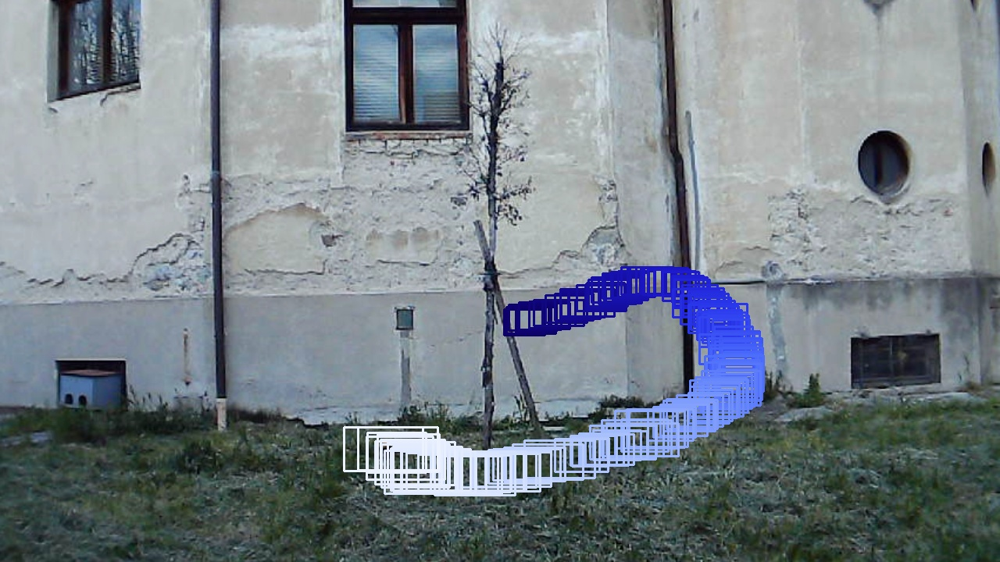
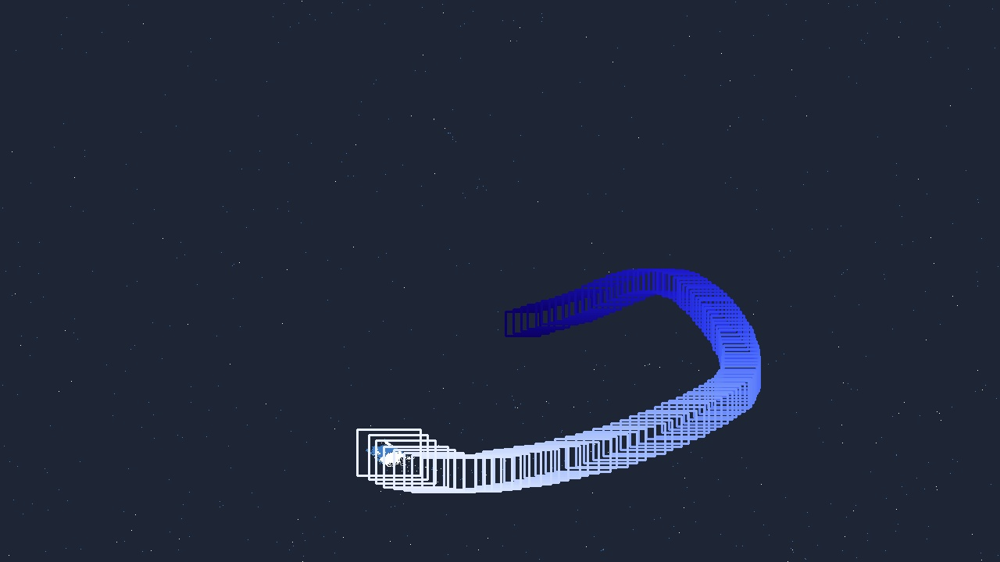

# SPAICE Technical Challenge: Drone Detection & Tracking
A short project for an application to SPAICE.

## Dataset
I chose the [**Florence RGB-Event Drone (FRED) dataset**](https://miccunifi.github.io/FRED/) for its clean stereo data in a wide range of scenarios from an RGB-event camera pair.

The images are rectified for approximate pixel-to-pixel correspondences, which is helpful for measurement fusion. However, because no intrinsic or extrinsic camera calibration is provided, stereo depth cannot be recovered. This is a significant downside, but the FRED dataset still offered the best combination of data quality and quantity.

## Implementation Plan
**Libraries**

The project is implemented in Python using standard libraries, including **PyTorch**, **NumPy**, and **Matplotlib**. YOLO models for drone localisation were obtained and fine-tuned with the **Ultralytics** library.

**Planned Structure**
1. Load frames (event or both event + RGB)
2. Run detection on the frame(s)
3. *If RGB not present*
   1. Transform detection(s) to a common 2D image plane
   2. Perform a 2D Bayesian update
4. *If RGB present*
   1. Triangulate detections into 3D using stereo/tri-stereo calibration
   2. Perform a 3D Bayesian update

**Implementation status**

Both detectors have been fine-tuned (see results below), but the tracking stage is incomplete due to time constraints. Although tracking is the part I am most comfortable with—my bachelor’s project focused on multi-object tracking—I must currently prioritise my master’s degree work.

## 2D Detection Results

  
  

**Figure:** Drone detections (no tracking) over 100 timesteps for both the RGB and event cameras.

Both detectors perform well in this sequence, though the RGB model’s bounding boxes suggest lower confidence in the drone’s exact position. The scene has favourable lighting; in more challenging clips, the RGB network struggled noticeably.

## Challenges Faced
Fine-tuning both detectors took longer than expected. The RGB detector was particularly tricky: the first run used a model with insufficient capacity, while the second unfroze too many layers, leading to catastrophic forgetting. Early results were acceptable on easy sequences but poor under adverse lighting.

After two overnight training runs, time became a serious issue. Attempting this project in parallel with the final weeks of my master’s project was ambitious, but I hope to continue it when possible.
